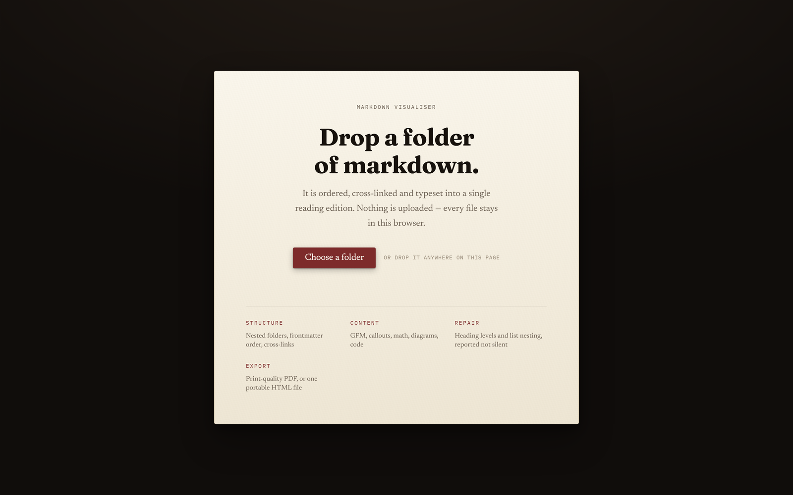
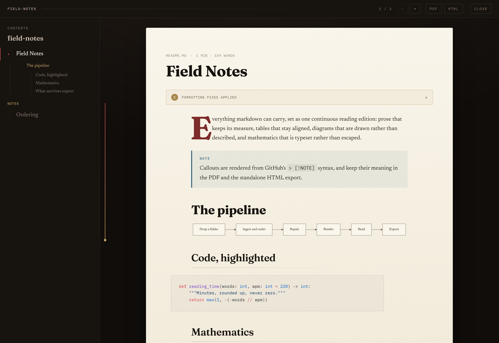
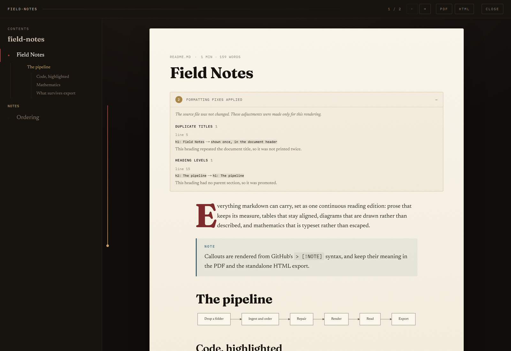

# Markdown Visualiser

Drop a folder of markdown files into a browser and get back a typeset reading
edition: ordered, cross-linked, and set on an archival paper surface built for
reading rather than for scanning. Export it as a print-quality PDF or as a
single self-contained HTML file.

> ### Design by Meng To
>
> **The entire visual design of this project comes from the work of
> [Meng To](https://github.com/MengTo) — full credit for how this looks
> belongs to him.** The archival-paper direction, the serif typographic
> hierarchy, the index-as-navigation, the layered elevation and the progress
> rail are all implementations of design direction he published in
> [MengTo/Skills](https://github.com/MengTo/Skills) (MIT).
>
> See [CREDITS.md](CREDITS.md) for exactly which skills shaped which parts,
> and go look at [his work](https://github.com/MengTo?tab=repositories) and
> [Design+Code](https://designcode.io) directly.

## Purpose

It exists for one narrow purpose — helping people read markdown files in a
neater, more legible way than a raw editor or a utilitarian preview pane
allows.

- Understands a folder: nested directories, frontmatter ordering, numeric filename prefixes, `README`/`index` conventions, and relative links that become in-app navigation.
- Renders GFM, `> [!NOTE]` callouts, KaTeX maths, Shiki-highlighted code, Mermaid diagrams and local images with a lightbox.
- Repairs messy markdown for the rendering only, and lists every repair (line, before, after) in the document. The source file is never modified.
- Exports a PDF with running heads and page numbers, or one portable HTML file that works offline.

Drops are capped at 200 MB / 2000 files / 10 MB per file; PDF request bodies at
20 MB. Not in scope: editing markdown, persistence between sessions,
authentication, cloud sync, or live filesystem watching.







## Technologies

TypeScript (strict), React 19, Vite 7, Zustand, unified/remark/rehype, Shiki, KaTeX, Mermaid, Fastify 5, Playwright (Chromium), Vitest, Docker. Typography is Fraunces, Newsreader and IBM Plex Mono (SIL OFL), self-hosted, so the app makes zero third-party requests. See [docs/DEPENDENCIES.md](docs/DEPENDENCIES.md).

## Architecture at a Glance

There is exactly one markdown pipeline, and it runs in the browser. The server is a static host plus a stateless print service that receives already-rendered HTML.

```
  browser:   drop folder → ingest → DocumentSet → repair → sanitise → render → reader
                                                            ↓
                                              inline all CSS + assets
                                                            │ POST rendered HTML (PDF only)
  container: Fastify → Playwright Chromium (JS off, network blocked) → PDF
```

Trade-off: document content leaves the browser at PDF export time. It is held in memory for one request and never written to disk. The HTML export is entirely local.

Details: [docs/ARCHITECTURE.md](docs/ARCHITECTURE.md), [docs/DESIGN.md](docs/DESIGN.md), [docs/SECURITY.md](docs/SECURITY.md).

## Prerequisites

- Node.js 20 or later (`package.json` `engines`; `init.sh` enforces it) and npm.
- Docker, for the container and for the browser and security tests.

## Local Development

```bash
./init.sh                     # checks toolchain, npm ci, vendors design skills, typecheck, build, tests
docker compose up --build     # → http://localhost:8080
```

For development without Docker: `npm run dev` (Vite) and `npm run dev:server` (`tsx watch server/index.ts`). Whether PDF export works from the Vite dev server without the container: uncertain — verify with developer.

## Running Tests

```bash
npm run typecheck
npm run lint
npm test -- --run
npm run test:e2e       # browser drives; needs the container running
npm run test:security  # adversarial probe of the PDF endpoint
```

See [docs/TESTING.md](docs/TESTING.md).

## Deployment

Docker two-stage build, run with `docker compose up --build -d`. Bound to `127.0.0.1:8080` because the service is unauthenticated. The application is stateless. See [docs/DEPLOYMENT.md](docs/DEPLOYMENT.md) and [docs/OPERATIONS.md](docs/OPERATIONS.md).

## Documentation

| Document | Contents |
|---|---|
| [docs/ARCHITECTURE.md](docs/ARCHITECTURE.md) | Components and information flow |
| [docs/DESIGN.md](docs/DESIGN.md) | Boundaries, conventions, error handling |
| [docs/HOW_IT_WORKS.md](docs/HOW_IT_WORKS.md) | End-to-end workflows |
| [docs/DATA_MODEL.md](docs/DATA_MODEL.md) | In-memory entities, limits, business rules |
| [docs/API.md](docs/API.md) | The two HTTP endpoints |
| [docs/SECURITY.md](docs/SECURITY.md) | Trust boundaries and controls |
| [docs/DEPLOYMENT.md](docs/DEPLOYMENT.md) | Build, configuration, rollback |
| [docs/TESTING.md](docs/TESTING.md) | Test strategy and gates |
| [docs/OPERATIONS.md](docs/OPERATIONS.md) | Monitoring and incidents |
| [docs/MAINTENANCE.md](docs/MAINTENANCE.md) | Handover, debt, fragile areas |
| [docs/TROUBLESHOOTING.md](docs/TROUBLESHOOTING.md) | Known problems |
| [docs/DEPENDENCIES.md](docs/DEPENDENCIES.md) | Critical dependencies |
| [docs/adr/](docs/adr/) | Architecture decision records |
| [CHANGELOG.md](CHANGELOG.md) | Changes |

## Licence

MIT — see [LICENSE](LICENSE). The design credit above is not a licence
condition but a statement of fact: the look of this application is Meng To's
work, and [CREDITS.md](CREDITS.md) records it in full. Bundled fonts are SIL
OFL 1.1.

<!-- sources: README.md (previous version), package.json, init.sh, docker-compose.yml, server/index.ts, src/types/domain.ts -->
